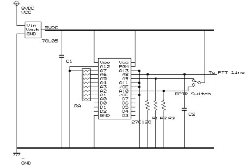
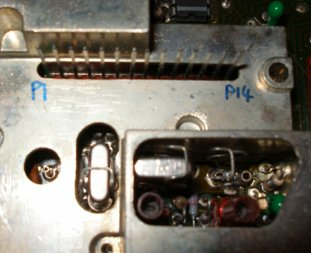
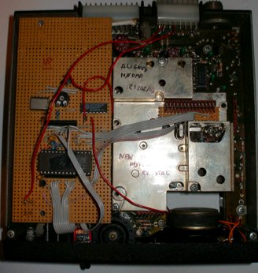
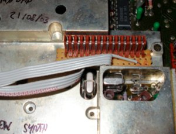

# Storno 5000 100-channel EEPROM conversion

## Introduction

The Storno 5000 is in my opinion ideal for a 100 channel conversion.

Firstly, as the prom board needs to be replaced anyway, it’s well worth the extra effort to build a 100-channel solution, rather than a 10-channel diode matrix solution, for example.

Secondly, there’s plenty of space in the top half of the radio chassis, which makes installing a veroboard-based solution easy.

The mod outlined here gives you 100 channels, with simplex, -600kHz repeater shift, and reverse repeater shift, depending on the position of the front panel switch.

### Files needed

Click to download:

[EEPROM image file (S3F format)](./storno.s3f)

[Channel list](./storno_channels.doc)

## Details

First, convert the radio to 2m following the instructions on the 2m conversion page.

Remove the selcall board in the left hand side of the ‘top half’ of the radio. If you want to install a 1750Hz toneburst later, remove the push-switch that used to fit through the front panel from the selcall board.

Remove the prom board, and desolder the 14-pin connector from it, as you will need it later on.

I built my circuit on veroboard, and also fitted in a 1750Hz toneburst circuit, and still had plenty of space remaining. The circuit diagram for the 100 channel mod is as follows (thumbswitch and data conns omitted for clarity)

Notes:

* Address lines A0->A7 are used for the thumbswitches
* Address line A8 is used for PTT (low on TX)
* Address lines A9 and A10 are used for repeater shift and rev repeater shift respectively.
* A11, A12 and A13 are grounded (no pulldown resistors needed) – not used.

## Parts:
* C1, C2: 10microFarad tantalum-bead capacitors
* RA: 10K ohm resistor pack
* R1, R2, R3: 10K ohm resistors
* EPROM: 27C128
* Voltage regulator: 78L05 5V output regulator
* Repeater shift switch: 3 position, centre off, latching switch
* Thumbswitches: 2x miniature 0-9 thumbswitches.
* 14 pin connector for synth (salvage this from the old PROM board)

## Connections

* Synth connector: 8V DC input is found on pin 1 of the connector.
* D0 of EPROM -> pin 2 of the connector
* D1 of EPROM -> pin 3 of the connector
* D2 of EPROM -> pin 4 of the connector
* D3 of EPROM -> pin 5 of the connector
* D4 of EPROM -> pin 6 of the connector
* D5 of EPROM -> pin 7 of the connector
* D6 of EPROM -> pin 8 of the connector
* D7 of EPROM -> pin 9 of the connector

* (Pins 10->13 are unused)

* The PTT line is found on pin 14 of the connector.

I numbered the pins as follows:

* Thumbswitches:

Connect the ‘common’ pole of both thumbswitches to the 5VDC output of the voltage regulator.
‘tens’ switch:
8 -> A7 of EPROM
4 -> A6 of EPROM
2 -> A5 of EPROM
1 -> A4 of EPROM

‘units’ switch:
8 -> A3 of EPROM
4 -> A2 of EPROM
2 -> A1 of EPROM
1 -> A0 of EPROM

EPROM:
The EPROM image designed to work with the above schematic is available for download above.

A similar conversion will work for UHF Storno models also, but will require different EPROM images to be made.

It would be possible to have 255 channels by using hexadecimal thumbswitches and a different EPROM image, but I decided not to as I think in decimal and 100 channels gives me a pretty reasonable coverage of the band.

## Fitting it all together

Find a piece of veroboard large enough to fit inside the radio, replacing where the toneboard previously sat. This means you can use the original two screws for mounting it into the radio. If you choose to use a smaller piece, you will have to find an alternative method of securing it into the radio.

Assemble the circuit using the details above. If you want to use the 1750Hz toneburst modification also, make sure you leave enough space on your piece of veroboard to allow you to mount the switch (earlier removed from the selcall board) to allow it to protrude through the front panel in the correct place.

There is sufficient space between the veroboard and the radio chassis to use a socket on the EPROM, if you so desire. I did on my modifications, so that I can replace the EPROMS easily if needed in future.

Power from the circuit comes from two points:

12VDC from Pin 14 of the synth connector
GND from the chassis of the radio – I soldered a piece of braid to the bottom of the veroboard where the rear mounting screw affixes to the chassis, providing a robust ground connection. This then powers all the circuits on the board.

A photo of the board fitting into my storno is shown below.

Connections to the synthesizer pins: I used a small piece of veroboard, the original 14 pin connector from the PROM board, and a length of old hard disk ribbon cable to connect it to the main veroboard. A closeup of this arrangement is shown here:

I used more ribbon cable to connect the thumbswitches and the repeater switch cable to the main prom board, as the photo below shows. To the left of the photo below, you can see the toneburst switch mounted to the prom board ‘upside down’ through the tracks. This photo shows also that I had to remove a small corner of the upper synth circuit board in order to fit the thumbswitches. This contained only a single track, which the red wire shown above bridges. You may not need to do this, depending on the size of your thumbswitches.

To provide some ideas about how to mount things to the front panel, here is a photo of the front of my modified Storno:

I chose to fit the repeater/simplex/rev repeater shift switch through the now unused hole at the top, previously used for the LED on the selcall board. The thumbswitches are fitted into the hole left by another selcall board button (a small amount of filing might be required depending on the size of your thumbswitches. The tone-send button on the selcall board has been reused for the 1750Hz toneburst modification. The original 12 position rotary switch is still present but serves no function. I might replace it with a small S-meter or similar eventually.
