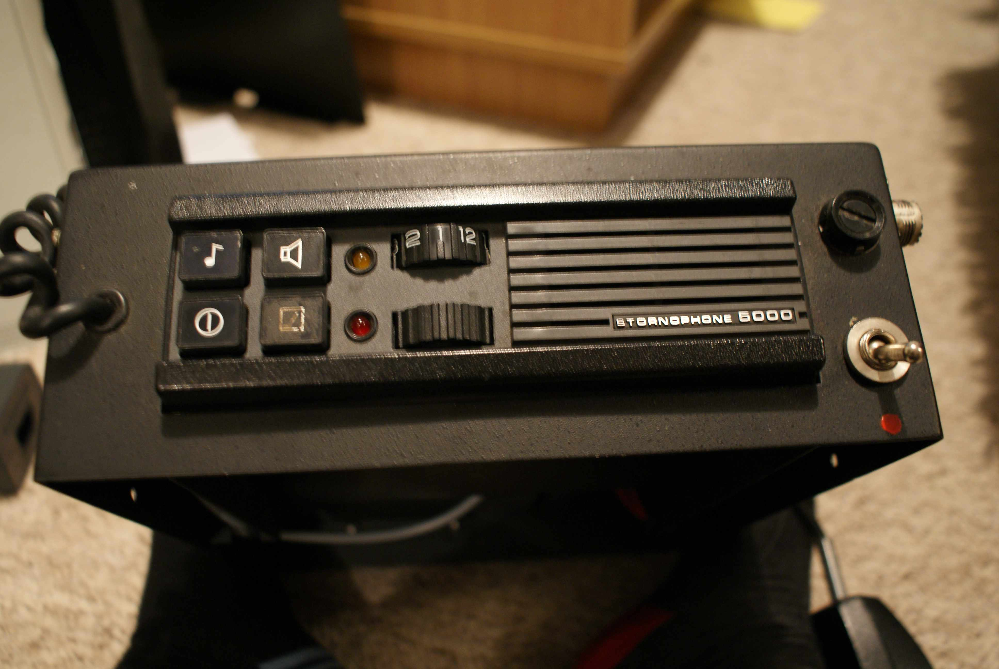
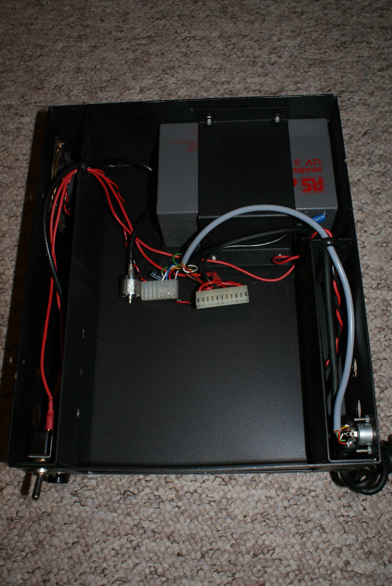
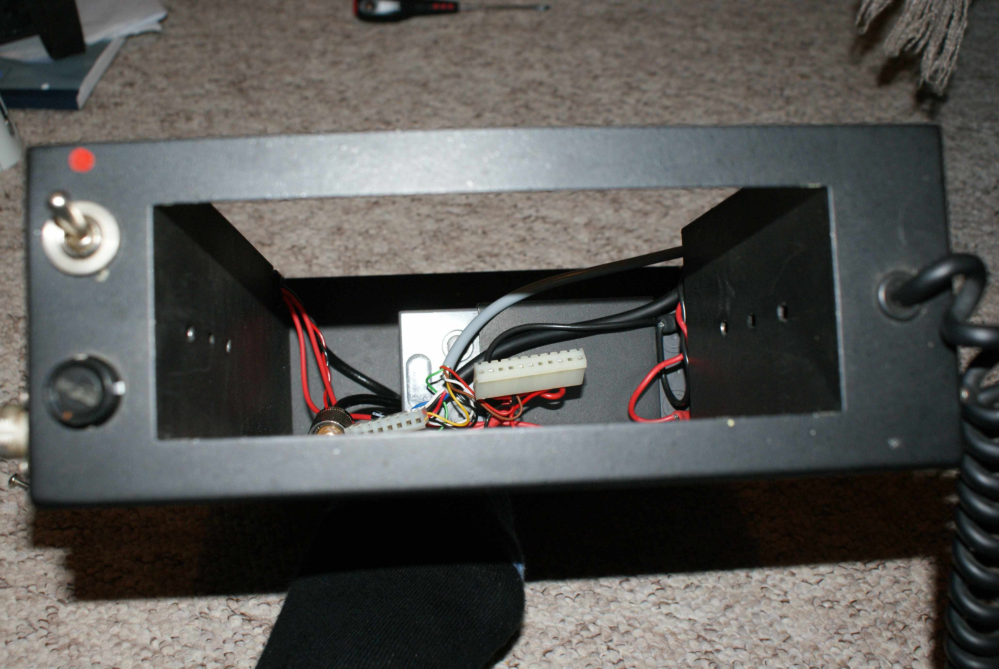

# Storno ‘portable case’ curiosity

At a local radio club bring and buy sale, I came across one of these:

It’s a portable carrying case for a Storno 5000 series radio along with a leather outer case. It has a clip-on lid with a clear plastic viewing window so you can see the top of the radio with the lid shut. It is certainly splashproof but wouldn’t say much more than that about it!

It had an old 4m crystal controlled storno in, so I have removed that and will put one of my synthesized ones in instead.

It has a sealed lead acid battery in the lower part of the case, an external power on/off switch and fuse, a loudspeaker (behind a small grille of drilled holes) and an external SO-239 connector for the antenna.

It also has a pair of DIN connectors on the side (a 2 pin one for charging the lead-acid + powering the set, and an 8 pin one, which I am guessing allows another external mic/speaker, but I haven’t looked at these yet!

Not sure that it is portable enough to take on a hike unless you wanted to prove a point, but it would be a good portable ‘base station’ for field work perhaps!

A few more pics of the ‘guts’:

