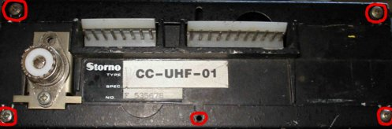
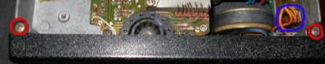
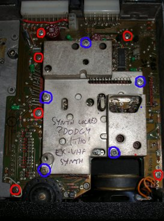
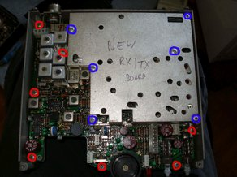
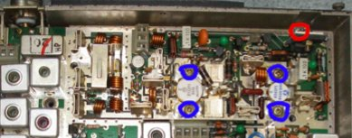

# Dismantling the Storno 5000 series

## Removing the top and bottom casings

Firstly, remove the top and bottom covers from the radio by removing the screws circled in red, and lifting the covers up, then sliding them back slighly to remove them.

## Removing the front panel

Remove the two screws on the top (circled in red), turn the radio over and remove the two corresponding screws on the underside. Unclip the front panel speaker connector (if present) and pull the front panel horizontally off the radio.

## Removing the synthesizer board

Remove the screws circled in blue, and lift off the die-cast housing. Remove the red-circled screws, and lift the board gently (from both the back and front – remove the front panel first). There are long pins which protrude the board to communicate with the RF board underneath – avoid bending these when removing the board.

## Removing the RX/TX board

First, remove the screws circled in blue, and lift off the die cast housing. Then, remove the red-circled screws.

In the top corner of the radio (PA section), remove the red-circled screw, and then the four blue-circled screws which anchor the PA transistors to the radio chassis. These screws fix into captive nuts underneath the synth board on the other side of the chassis. Sometimes these nuts fall out when the screws are withdrawn – if this happens, you will need to remove the synth board to resite them. I’d recommend applying a blob of silicon sealant to the nuts to ensure they are held captive in future if you encounter this problem.

Loosen the screw nearest the top side of the radio on the SO-239 socket – it does not need to be removed completely. Then, lifting from the front of the board, and the SO-239 at the back, lift the RF board free of the radio chassis.

Reassembly is accomplished by reversing the above steps – It is worth applying new thermal conductive paste (you can often get these from computer shops) on the bottoms of the PA transistors on refitting to ensure good conduction of heat to the radio chassis.
