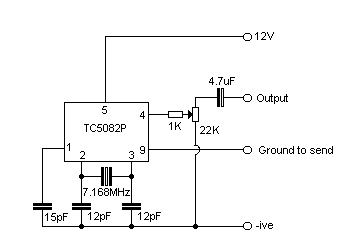
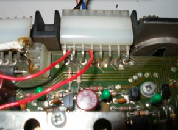
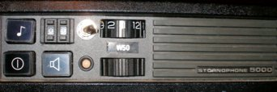

# 1750Hz toneburst

## Introduction
This modification is best combined with the 100-channel modification, as there’s plenty of room left on the 100-channel veroboard to fit this in, and it can share the power and ground connections. It also provides a convenient location to mount a push switch so that it protrudes through the front panel. The modification fitted into my radio uses one of the switches from the selcall board to activate the tone generator and to key the radio into TX when the button is pressed.

## Circuit
I used a design by Andy Potts, the layout of which is reproduced below, with his permission. His website is available here.

This design does not have any provision for frequency adjustment – this is because the frequency is crystal controlled, and is extremely accurate (even accurate enough to open my ‘home’ repeater, GB3SR, which is notoriously picky about such things!)

## Connections
The +ve connection comes from pin 14 on the synth connector (the one on the far right, with the radio front facing towards you) -it’s 8VDC. I’ve numbered the pins as follows:

GND comes from the chassis of the radio – the veroboard design I used has a piece of braid soldered to the bottom of one of the mounting screws for this. The ground-to-send line is wired up using one gang of the dual gang front panel switch that I salvaged from the selcall board. Connect the common (centre two pins) to ground, and connect one of the rear gangs to pin 9 on the TC5082P of the toneburst circuit. The other gang is wired to the PTT line of the microphone socket on the back of the radio, so that pressing the toneburst switch keys the radio into TX as well as enabling the tone generator. The audio output from the circuit is fed into the audio connection on the microphone socket on the back of the radio. The deviation of the tone can be adjusted using the potentiometer in the circuit above to set the deviation at a suitable level. The connections to the microphone socket are shown here – looking from the front of the radio.

The connection on the left (2nd pin in from the left) is the PTT line and is wired to the TB switch. The connection on the right (4th pin in from the left) is the audio output from the toneburst circuit. To give you an idea of the front panel layout I used, this is shown below – the toneburst switch is on the top left.

