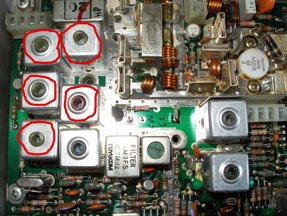
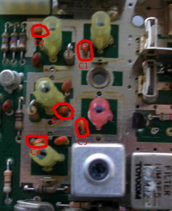
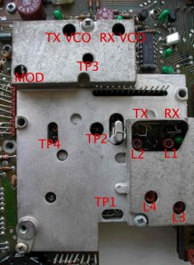
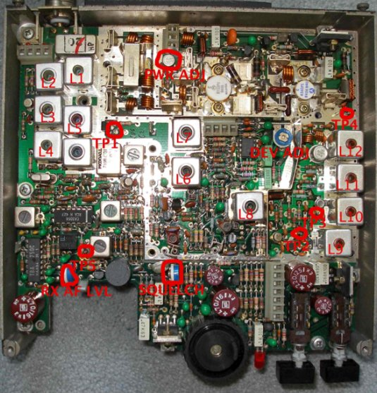

# Introduction

Converting the Storno CQM5112 to the 2m band is reasonably easy, though it does require a bit of patience, and a few tools etc. A few capacitors on the RF front end need replacing to improve sensitivity, and two new crystals from Quartslab are needed to configure the synthesizer for 144MHz. The modification steps outlined here are based on the original document GWM radio supplied with the radios, although I have simplified some steps I did not find to be necessary.

# Parts needed

## Crystals:

* 1x 43.36666MHz series resonant crystal (available from Quartslab)
* 1x 46.93333MHz series resonant crystal (available from Quartslab)

## Capacitors:

* 1x 8.2pF ceramic plate
* 1x 10pF ceramic plate
* 2x 12pF ceramic plate
* 1x 15pF ceramic plate

# Tools needed

* Screwdrivers
* Plastic tipped ‘twiddlers’ for the ferrite cores – do NOT use a small screwdriver, it will crack the cores.
* Dummy load
* VHF power meter reading 20-50Watts
* Frequency counter (not ESSENTIAL, but recommended)

# Steps

## Component changes

1. Remove the RF board from the radio (follow the instructions here: Storno 5000 dismantling)

1. Remove the screening cans circled in red by desoldering their mounting pins from the underside of the board.
	

1. Remove the capacitors circled in red and replace them with the following values:

* C1: 12pF
* C2: 10pF
* C3: 12pF
* C4: 15pF
* C5: 8.2pF

1. Once this is done, replace the screening cans and resolder them into place. Remount the board in the radio. (If you want to fit the bicoloured LED modification, this is an ideal time to do it – Storno 5000 bicolour LED for more details)

## Synth alignment

1. Remove the old crystals from the crystal holders labelled TX and RX in the photo and fit the new ones. (TX: 46.93333MHz, RX: 43.36666MHz). If you find it difficult to remove the old ones, it may be easier to remove the synthesizer die cast housing first.

1. Connect a diode probe to TP1, and adjust L1 and L3 for maximum deflection on RX. Operate the microphone TX switch (the TX led will NOT illuminate yet) and adjust L2 and L4 for maximum deflection. Next, connect a high impedance DC meter to TP3. Adjust the RX VCO trimmer to obtain approximately 2v deflection.

1. Operate the microphone TX switch and adjust the TX VCO trimmer to obtain approximately 2v deflection. At this point, the red TX led should now illuminate when the TX switch is depressed. If you have an oscilloscope available, connect it to TP2 and adjust L3 and L4 for maximum amplitude. Connect a frequency counter to TP4. Adjust L1 to obtain a frequency of 133.300 on RX, and L2 to obtain 144.000 on TX.

RF board layout:

## Receiver alignment

1. Connect the diode probe to TP1 as shown below and adjust L6 and L7 for maximum deflection. Then, either connect a signal generator to the SO-239 socket and apply a signal of 144.000MHz. Alternatively, connect an aerial and provide a strong local signal.

1. Connect the diode probe to TP5 and adjust L1, L2 to peak the reading on the meter. Detune L3 and L5 as much as possible. Then, adjust L4 to peak the reading as much as possible. Do not adjust L4 again after this point. Adjust L3 and L5 now to peak the reading on the meter. Now, L1 and L2 can be readjusted to maximise the reading. Keep reducing the RF input each time and readjust L1, L2, L3 and L5 to maximise the reading. Finally, adjust the squelch potentiometer to set the squelch to the desired level.

## Transmitter alignment

1. Connect a power meter and dummy load to the aerial socket. Key the radio into TX and leave it transmitting while the next steps are followed.

1. Connect a DC voltmeter to TP2 and adjust L8 to obtain the maximum reading. Then, connect the meter to TP3, and adjust L9 and L10 for maximum. Connect the diode probe to TP4 and adjust L11 and L12 for maximum.

1. At this point, the power meter should indicate power is being output. I recommend at this point carefully readjusting L8, 9, 10 and 11 to peak the power output. Once this has been done, check the transmitted signal with another receiver to check it is stable (no whistling etc).

1. Finally, adjust the power output to a level not exceeding 25W using PWR ADJ as labelled in the diagram.

1. Deviation can be adjusted if necessary using the deviation control on the RF board marked DEV ADJ – the control labelled MOD on the synthesiser board is not a deviation control as such and should ideally be left alone. If you find that you cannot obtain sufficient deviation from the RF board control, it can be carefully adjusted however.
