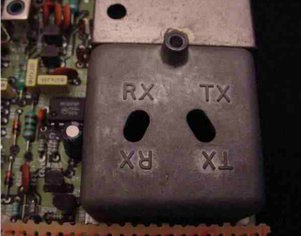
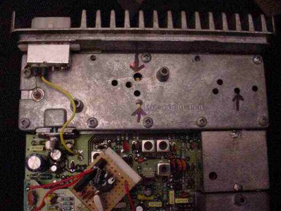

# T535 VHF -> 2m Conversion

## Introduction

The Tait T500-series radios are very easy to convert to 2m operation, as they were designed for wideband usage, and therefore no component modifications are required to convert them to 2m.

However, there is some retuning required, and this will require some patience and some basic test equipment. I recommend at least the following:

* A multimeter, either digital or analogue
* An RF Power meter (a cheap-ish VHF Power/SWR meter is adequate for this).
* A frequency counter (you can manage without this in a pinch, but it does make life much easier!)
* A set of plastic tipped trim tools – do not use screwdrivers under any circumstances
* A dummy load – for social reasons!

The frequencies for this set (both transmit and receive) are set by the diode matrix situated on the right hand corner of the radio behind the front panel.

This needs to be modified initially to a 2m frequency to allow the radio to be tuned, even if you later intend to do the 100 channel modification described elsewhere on this site

Before beginning this procedure, remove the CTCSS board (if fitted).

You simply need to remove it – on these radios it is not necessary to bridge out any links if it is not present.

## Step 1 – Set up the diode matrix

Initially, the best place to set the diode matrix is on 145.000 MHz as it is in the middle of the desired band. This is therefore a good place to tune for maximum performance (ie max power out on Tx and max sensitivity on Rx).The diode matrix has four columns on it – RX2, RX1, TX2, TX1 – we only need to change a matching pair – I suggest RX1 and TX1 (the transmit and receive frequencies for channel 1.

Although we are making a simplex channel, the values for RX1 and TX1 are different due to the IF of the receiver. The following picture shows the diode matrix calculated for 145.000MHz. You only need to copy RX1 and TX1 as in this example both channels are set to 145.000MHz simplex.

## Step 2 – Getting the VCOs to lock

The next step is to adjust the VCO trimmers to bring the VCOs into lock for both Tx and Rx. Once this step is complete, you will be able to receive (assuming you have disabled the CTCSS on Rx – you can do this by removing the tone board temporarily during testing) – but don’t expect ANY sensitivity whatsoever). You will also be able to Tx (again, don’t expect ANY measurable power output though! Set the radio to channel 1 (assuming you set channel 1 on the diode matrix board to 145.000). Locate the VCO housing and the test point – the VCO housing is a small die cast housing on the right hand side of the radio, with two holes labelled TX and RX. Just beneath this is a set of three jumper-type pins sticking up from the board (labelled TP-2). The middle pin is the VCO lock test point – connect a multimeter to this and set to a range suitable for measuring 4 Volts DC with respect to ground. The housing is shown below:

Attach your dummy load, and key the radio into Tx. Using a small screwdriver (better to use a plastic handled trim adjustment tool with a metal tip) adjust the TX trimmer through the appropriate hole in the housing until the voltage on the test pin is 4 Volts DC (+/-0.5V). Having done so, allow the radio to return to Rx, and adjust the RX trimmer in the same way. Now, the VCOs are locked correctly onto 145MHz, and you should be able to hear yourself on a sensitive nearby receiver, and hear a close-by transmitter!

## Step 3 – Tuning the Receiver

Accurate tuning of the receiver is not possible without a proper communications analyser. However, ‘good enough’ sensitivity IS possible to achieve through a little perseverance and care. The first step is to come up with a local signal source. I achieved this with a colleague with a 2m handheld. Key the handheld into TX and turn up the volume on your Tait (not enough to get feedback!) Adjust the following ferrite cored trimmers using ONLY the plastic tipped trim tools: L19, L15, L13, L12 and L10. As you do so, you will hear the signal become stronger (less background noise), and clearer. After several iterations of this process, the signal will be MUCH clearer than before. Next, drop the TX power on the handheld down a setting, and repeat, using smaller adjustments this time. Finally, I ended up using 50mW power output on the handheld, transmitting into a dummy load, with no antenna connected to the Tait and could still manage to hear it from the end of my garden. Keep going through this procedure (weakening the input signal and peaking the sensitivity of the receiver) until you are happy that the receiver sensitivity is as good as possible.

## Step 4 – Tuning the Transmitter

The transmitter is fairly easy to tune, and relatively stable. You will need a receiver, a frequency counter, a power meter, and a dummy load. Tune your receiver to 145.000, attach your power meter and dummy load to it, and position the frequency counter nearby. You will need the receiver and frequency counter to monitor for any signs of stability (odd noises on the transmit signal, and frequency fluctuations). Adjust potentiometer RV26 (Power output control – just above CTCSS board if fitted) to mid position. Key the radio into transmit, and carefully adjust the following three trimmers using the metal tipped trim tools: CV273 (small green one at right end)and CV289(middle top) and CV290(middle lower). These trimmers are located inside the large die cast housing at the back of the radio as shown in the photograph below (arrowed).

You need to have the lid on this compartment during tuning but if you prefer you can remove the lid briefly to ensure you know where they are located. You can adjust them through the holes in the lid of the compartment. I strongly recommend using plastic handled trim tools, to reduce the effect of your body’s capacitance on the tuning of the transmitter section. As you tune these trimmers, you will notice power output appear and begin to increase. Carefully continue to adjust these trimmers, one at a time for maximum power output, checking the frequency counter to ensure you are not tuning the transmitter to a spurious harmonic. As in the receiver, there is some interaction between these trimmers, so several iterations are necessary to produce peak performance and efficiency. If you feel the radio becoming very hot during this process, allow it to cool down between tuning attempts, to avoid overheating. Peak the transmit power as much as possible (without introducing instability). Once this is done, and you have a clean signal on 145.000 adjust RV26 again to set the power to between 15 and 20 Watts. (Ensure the total current drawn is not greater than 4.5 Amps – if it is, readjust the PA trimmers to bring it down to within this range.)

## Step 5 – Deviation Adjustment

You will want to ensure that your deviation is suitably set for 12.5kHz channels (recommended) or 25kHz channels (obsolete). Assuming you do not have a deviation meter, set a receiver (preferably a new-ish one with 12.5kHz channel-size filters) and adjust the deviation using RV79 (situated under the CTCSS board if fitted) until the audio is a reasonable volume. Tune the receiver 12.5kHz up and shout into the microphone – there should be NO splatter onto this channel. If splatter does occur, lower the deviation level until it disappears. Step 6 – Frequency Calibration You may find that your radio is slightly off frequency. This can be corrected by adjusting the ferrite-cored trimmer L30 situated under the diode matrix board (but can be accessed without removing it). Only attempt this if you have an accurate frequency counter. Only a small adjustment (if any) should be necessary here. Adjust the trimmer carefully using a plastic tipped tool until the frequency is as accurate as possible.

That’s it! You should now have a 2m tuned T500 series Tait – you can now complete your conversion either by setting up the diode board for two channels you find useful, or proceed with the 100-channel modification, or add a 1750Hz toneburst, or even set up the CTCSS tone board (if fitted).

If you found these instructions useful, or found any errors or omissions, please email me and let me know!
