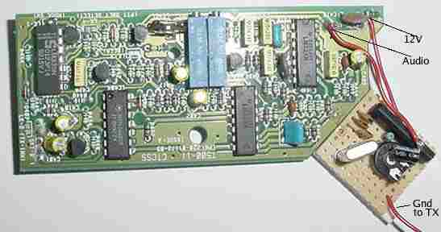

## T535 VHF CTCSS board configuration

The CTCSS board most commonly seen in these radios is labelled T500-11, and is shown in the photo below (also shown is my piggyback 1750Hz toneburst circuit:

This has two rotary multiple position switches (the two blue blocks in the middle of the photo above), one of which sets the tone for Channel 1 and the other for Channel 2. These boards are NOT capable of split tone operation – where one tone opens the squelch, but the radio transmits a different tone.

Personally, I prefer to disable CTCSS on receive, and simply have a tone on transmit. This can be accomplished by soldering a link on the CTCSS board. Close examination of the board will reveal a pair of pads labelled Hook SW (hook switch). If these are bridged together, and all the other pads are cleared, then a tone will be transmitted, but none will be required to open the squelch on receive. If my 100channel modification is fitted, the channel switch can be used to select one of two ctcss tones (or alternatively one tone, as it is possible to disable a CTCSS tone altogether on one channel.)
The other links have functions not normally used by radio amateurs. e.g. LK-2 will inhibit transmit if a different tone is being received.

To set up the radio to use the desired tone, you will need another radio, which is capable of transmitting a tone. Ensure you have aligned the radio initially, as per the instructions (2m instructions ) Set your other radio to match the frequency your Tait is receiving on, and set it to transmit the desired tone. Key your transmitter. Note which channel the Tait is using (1 or 2 – view the lights on the front panel to determine this) and adjust the appropriate blue multi-position switch until the squelch opens – at this point you have the right tone. Note – the switches have a freewheeling clutch so there is no ‘stop’ at the end of travel. If you aren’t getting anywhere, try turning the switch the opposite way – each click of the switch is a different tone.

Once you have found the correct position, you can transmit using the Tait and confirm that this tone is transmitted correctly also. The potentiometer (RV447 – Level) can be used to set the deviation of the transmitted CTCSS tone).
