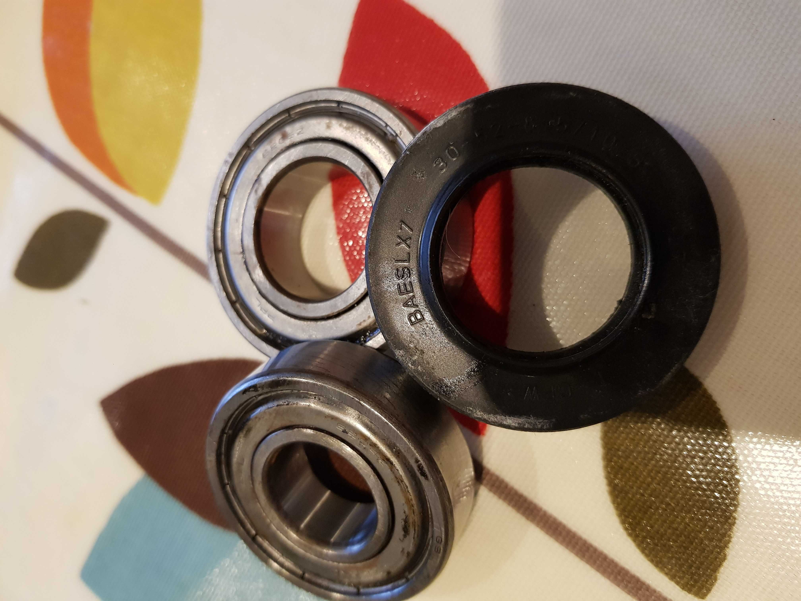
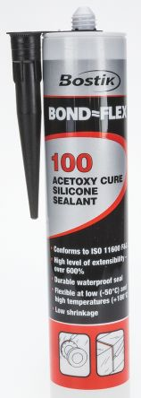
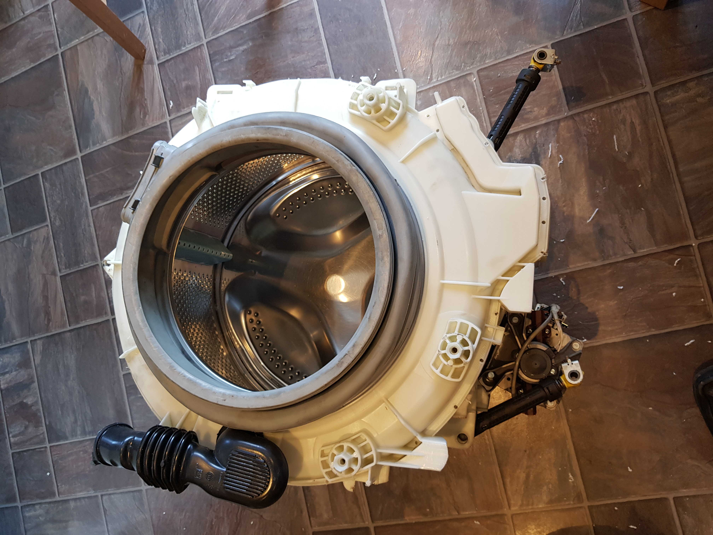
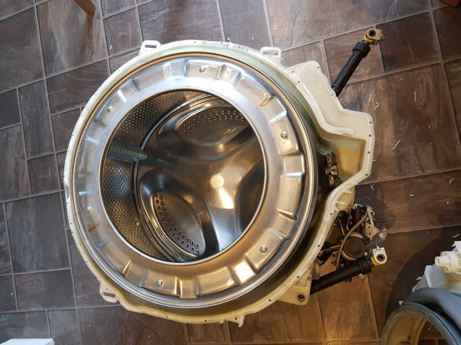
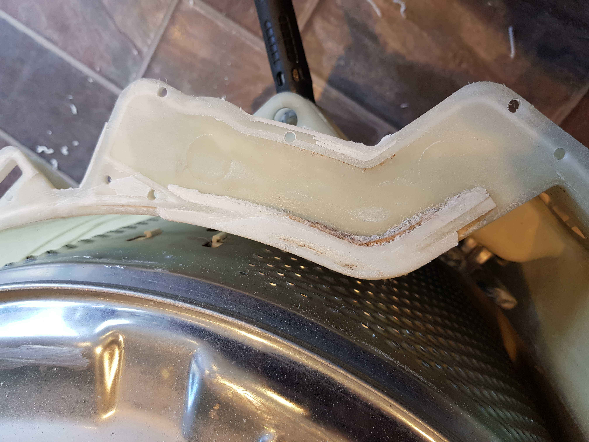

## Indesit IWDE126 IWDE126UK Drum bearing replacement

I have (had!) an Indesit IWDE126(UK) combined washer-dryer.

It’s about 7 years old and has had fairly heavy use. It’s started to develop a horrible rumbling noise when spinning, and I suspected the drum bearings might well be part of the problem.

On older washer dryers, the drum bearings could be replaced by removing the drum (and the outer plastic case, or tub) from the machine, undoing the bolts to split the drum, knock the old bearings out, drive in new ones, and rebolt the two halves of the tub back together (ideally with a new gasket to reduce the risk of leaks).

Unfortunately, like a lot of washer dryers now, the manufacturers have switched to sealed drums. The two plastic halves of the drum are welded together (either using solvent, or ultrasonically), so it is (supposedly) impossible to replace the bearings any more, leaving only the option of replacing the entire tub/drum unit. Unfortunately, including shipping etc, this is >£150 for my machine, making the repair pretty uneconomical even if I do the job myself.

After googling for a bit and finding a number of Youtube videos, some people have managed to replace the drum bearings on sealed drum machines by sawing the tub open along its’ weld lines, replacing the bearings and then drilling and bolting the two halves back together with a suitable sealant.

So, I did this, and it worked.

Here’s what I did (with some photos).

1. Find and order the bearings (and bearing seal) you need. For my machine, it turns out that you need a kit containing 6205Z and 6204Z bearings. Indesit supply a kit including the seal, as kit C00251855. It’s almost impossible to find anyone confirming what kit you need for the IWDE126UK, because Indesit don’t list a bearing kit, because the drum unit isn’t supposed to come apart! Old bearings and seal shown here: 

	

1. Decide on a suitable sealant to use to re-waterproof the joint between the two halves of the drum. I used this sealant from RS. It’s described as “Bostik 91360 Bond-Flex 100HMA Black Silicone Sealant Non-Slump Paste 300 ml Cartridge” and in its’ key features, says “Forms a waterproof, flexible seal which provides a good level of movement accommodation

	
	* Excellent adhesion to most building surfaces
	* Suitable for internal and external applications
	* For use over a wide temperature range; -60 to + 200°C”
	
	So hopefully this will be durable enough – the temperature range is certainly fine.
	
1. Get nuts and bolts – I used M4 25mm allen-socket-head bolts, M4 locknuts and M4 washers (all in stainless steel) from my local nut and bolt suppliers. I probably used about 35 of them in total, spaced around the circumference of the tub. Remember tha tthe sealant won’t provide much mechanical strength, and the sealed tub has a large concrete weight hung off the front, so these bolts are all that is holding the tub together really…!

1. Drill the holes for the bolts before sawing the tub apart, as it’s easier to get the alignment right that way, then saw the tub and separate the two halves. I tried to drill the holes as cloes to the outside edge of the drum as possible to try to give enough surface area for the silicone to seal to in order to create a waterproof seal. Here’s a photo of the predrilled tub, then the tub with the front section removed:

	
	

	I used a few techniques to saw them apart – a dremel with a rotating disc to make a small slot at the top of the drum assembly (where it never fills up to!), then used a jigsaw with a short blade to carefully cut round most of the circumference, then a hand saw to do a few bits where the jigsaw couldn’t easily get to. You will have to saw through the snap-locks which originally held the drum together, though you can easily concentrate a few bolts round here, as it’s outside the bit that provides the waterproof seal. Note that there is an area at the bottom of the drum where the water pressure sensor connects to that is almost impossible to saw through perfectly because of its’ shape. I applied plenty of extra silicone here to get a good seal:
	
	

	Once it was back together, I applied plenty of silicone to the outside of that bit too.

1. Replace the drum, knock out the bearings, and install the new ones, and the oil seal. Remember to only drive the new bearings home by hitting the *OUTER* ring to avoid damaging it. A pin punch or similar and a hammer would be ideal. Ensure both bearings are pushed fully home.

1. Apply a bead of sealant, join the two halves together, and bolt together. Allow >24hours for the sealant to dry.

1. Reinstall and check it is watertight – good luck! Here’s a photo of the reassembled drum in place. (And yes, it’s watertight!)

