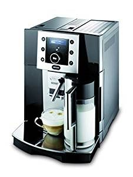
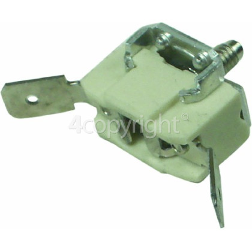
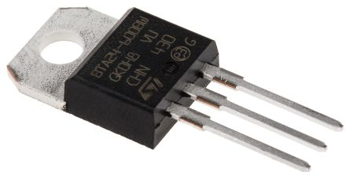
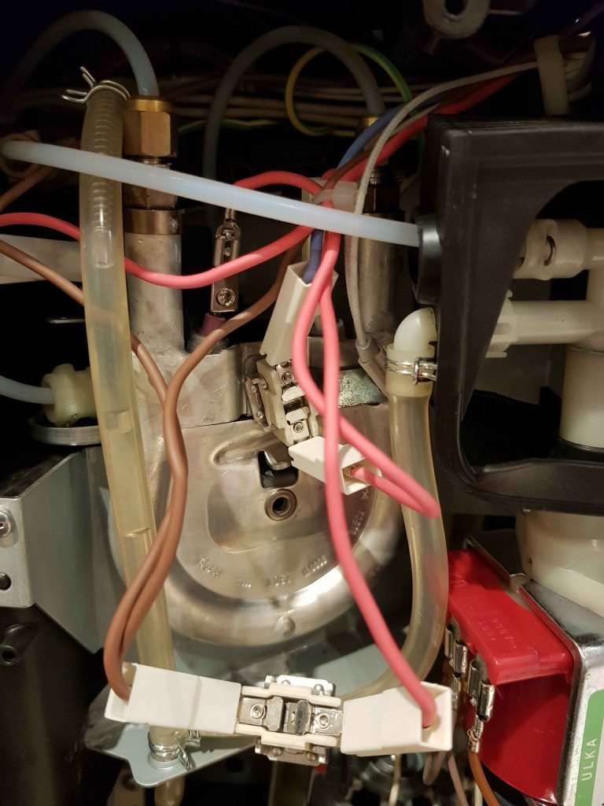
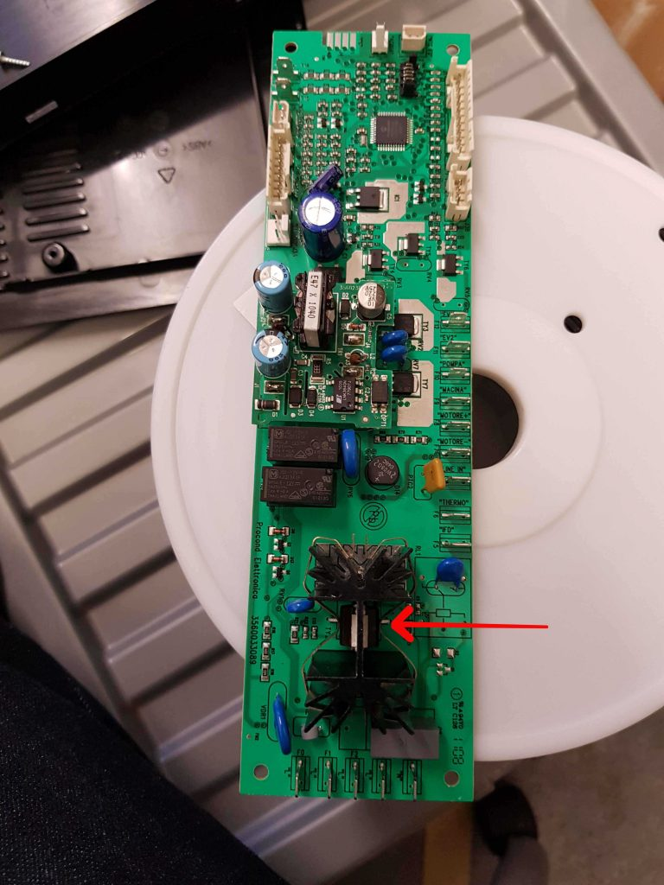
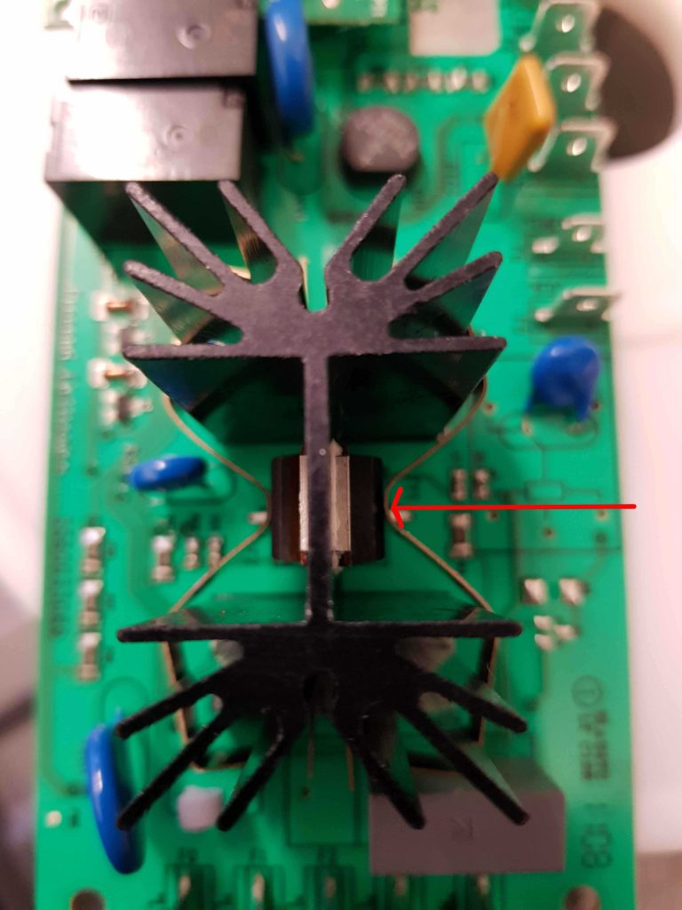
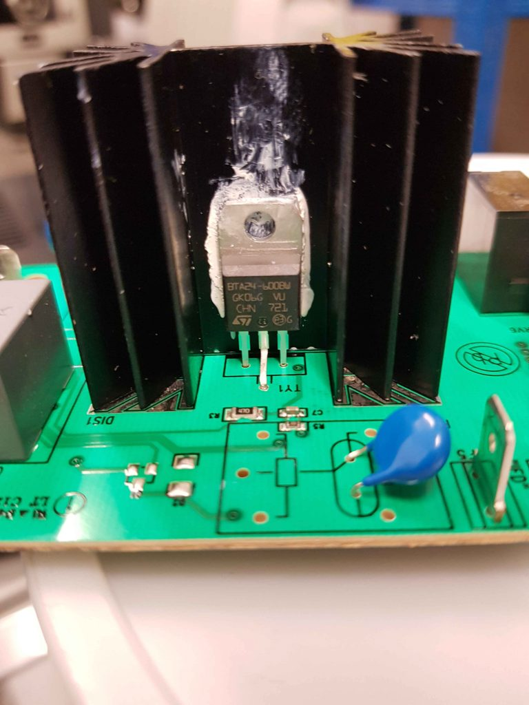

# Delonghi Perfecta machine fault – no steam!

I was given a machine from a work colleague to fix (a snazzy Delonghi Perfecta bean to cup machine) which wouldn’t froth milk or generate steam but did make coffee.  When asked to steam, it just displayed “Heating Up…” then returned to the main screen.

I guessed the steam boiler element had probably failed open circuit, so opened the machine up, and checked its’ resistance with a multimeter (which was around ~50 Ohms), so that wasn’t the problem.

The boiler element is protected by a pair of thermal cutouts, which will permanently blow (open circuit) if the element overheats to prevent a fire.  Both of these had failed.  So I thought that buying a new pair of these would solve the problem.

Then I found [this article](https://outwestcoffee.com.au/delonghi-perfecta-service-case-study-triacs-and-boiler-issues/) detailing a similar fault, where the triac which controls whether the element is on or not fails closed circuit, meaning the element overheats and blows the thermal fuses.  That article discussed the triac powering the main boiler rather than the steam boiler, but both are driven the same way.

This seemed to make sense and would explain why the thermal fuses had been blown.

Testing (carefully!) with the multimeter, I found that the element was continuously powered with full AC voltage even when the machine was on standby, so it became clear that the triac had failed closed circuit in this case.

So, to fix the machine, I replaced the two thermal cutouts from 4Delonghi: [2933924OH](https://www.4delonghi.co.uk/thermal-cut-out-fuse/product.pl?pid=1224702&query=2933924OH)

and the triac (from RS): Part No BTA24-600BW. From RS, it’s [6871029](https://uk.rs-online.com/web/p/triacs/6871029/)

and everything worked happily!

Here are a few photos of the repair:

* The horseshoe-shaped steam boiler (behind the back cover of the machine). You can see one dangling thermal fuse which I’d unbolted, the other at the centre of the image, and the two terminals of the boiler element. Both fuses are wired in series with the element – one in series with the triac-switched feed from the control board – lilac wire, and the other in series with the neutral return (brown wires).
	

* The control board, with the failed triac indicated with an arrow.  The one on the other side of the heatsink controls the boiler for the hot water. (and can fail in a similar way!)
	
 
* Faulty triac closeup (arrowed)
	
 
* The resoldered and re heatsink-compounded triac on the main circuit board prior to reinstalling the retaining clip and reassembling the machine.
	
